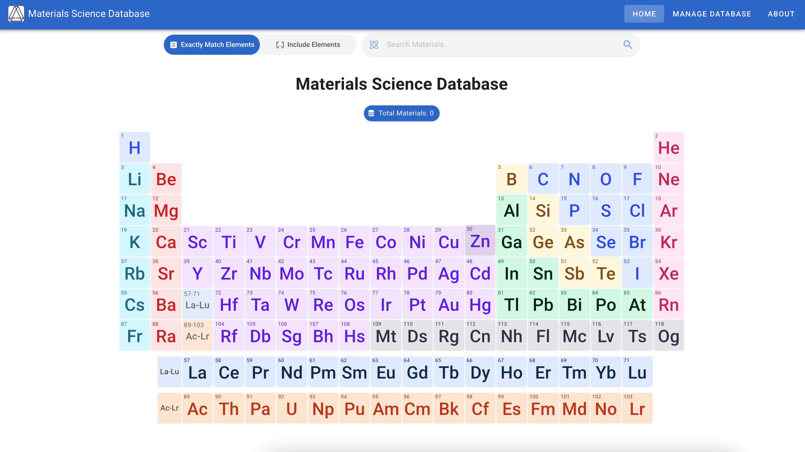
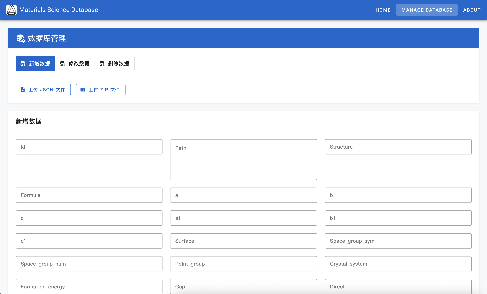
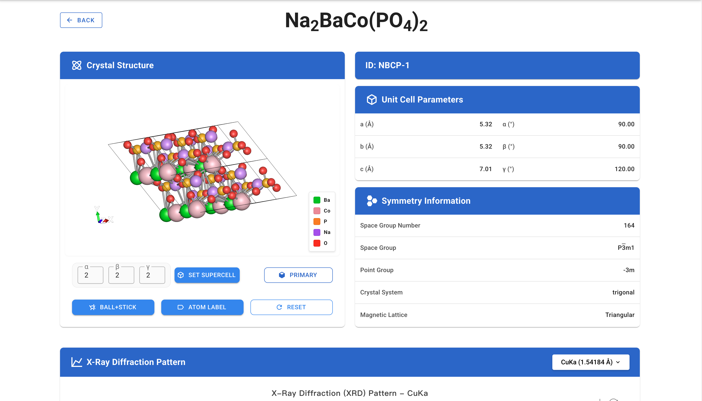
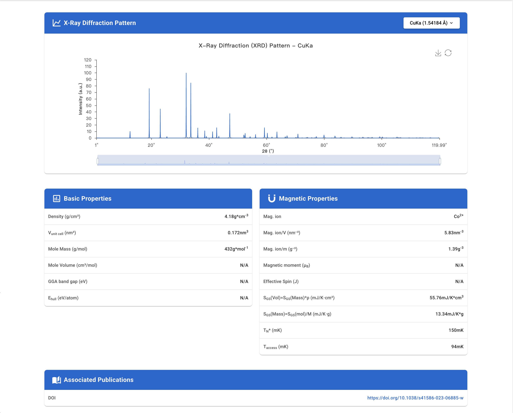

# Materials Science Database
[](README.md)

## Project Introduction
The Materials Science Database is a data management system designed specifically for materials science research, dedicated to providing storage, query, visualization, and analysis functionality for crystal structure data of materials. This system primarily targets materials science researchers and students, helping them efficiently manage, analyze, and utilize materials data to promote the development of materials research.

## Open Source Version Note
This project is the open source version of the Materials Science Database. To facilitate community use and secondary development, we have:
1. Removed all sensitive information and private configurations
2. Replaced all hardcoded connection strings with environment variable references
3. Removed authentication requirements, making functionality directly accessible
4. Retained the complete architecture and API interface design

The service implementation classes in the open source version only include method declarations, and the specific implementations need to be completed according to your own requirements and environment. We have added prompt comments in each method to facilitate your secondary development.

## System Architecture
The system adopts a front-end and back-end separation architecture:
- **Frontend**: Developed with Vue.js framework, using Element Plus and Vuetify component libraries combined with Tailwind CSS to build the user interface
- **Backend**: Uses Java Spring Boot to develop REST APIs, providing data storage, retrieval, and analysis functions
- **Database**: Uses MongoDB for storing crystal structure and magnetocaloric material property data
- **Storage**: Supports integration with object storage services for saving cif files

## Core Features

1. **Material Data Management**: Support for uploading, storing, and managing crystal files in CIF format
2. **Crystal Structure Visualization**: Provides 3D interactive display of crystal structures using ChemDoodleWeb
3. **XRD Spectrum Generation and Display**: Automatically calculates and displays X-ray Diffraction (XRD) spectra
4. **Magnetocaloric Performance Parameters**: Records and displays key parameters of magnetocaloric materials, such as Néel temperature, formation energy, etc.
5. **Advanced Search Functionality**: Support for multi-dimensional searches by chemical formula, space group number, magnetic lattice, etc.
6. **Periodic Table Query**: Integrated interactive periodic table to assist with material queries

## Screenshots









## Technical Features

- **Modular Design**: Backend uses a multi-module Maven project structure, including API, Service, DAO, and POJO modules
- **Responsive UI**: Modern responsive user interface built with Vuetify and Element Plus
- **Data Visualization**: Provides 3D visualization of crystal structures and XRD spectrum display
- **Cloud Storage Integration**: Can integrate with various object storage services for cloud-based crystal file management
- **Multi-wavelength XRD Data**: Supports XRD data analysis for multiple wavelengths including CuKa, CuKa1, and CuKa2

## Installation and Deployment

### Environment Requirements
- JDK 21+
- Node.js 16+
- MongoDB 6.0+
- Object Storage Service (such as Tencent Cloud COS, Alibaba Cloud OSS, AWS S3, etc.)

### Configuration Instructions
The following environment variables need to be configured before running:
- `MONGODB_USERNAME`: MongoDB username
- `MONGODB_PASSWORD`: MongoDB password
- `MONGODB_HOST`: MongoDB host address
- `MONGODB_PORT`: MongoDB port
- `COS_SECRET_ID`: Object storage service access ID
- `COS_SECRET_KEY`: Object storage service access key
- `COS_BUCKET_NAME`: Object storage service bucket name
- `COS_REGION`: Object storage service region
- `COS_DOMAIN`: Object storage service access domain

### Frontend Deployment
```bash
cd MCMD_frontend
npm install
npm run serve
```

### Backend Deployment
```bash
cd MCMD_backend
mvn clean package
java -jar api/target/mcmd_backend.jar
```

### Docker Deployment
Both frontend and backend provide Dockerfiles for quick image building:
```bash
# Build frontend image
cd MCMD_frontend
docker build -t mcmd-frontend .

# Build backend image
cd MCMD_backend
docker build -t mcmd-backend .
```

## Secondary Development Instructions
1. Backend service implementation classes need to be completed by you, located in the `MCMD_backend/service/src/main/java/com/tcmp2/service/Impl/` directory
2. Object storage utility classes need to be implemented by you, located in the `MCMD_backend/common/src/main/java/com/tcmp2/common/utils/` directory
3. The API paths in the frontend configuration files need to be modified according to your deployment environment

## Development Team
- College of Materials Science and Optoelectronics Technology, University of Chinese Academy of Sciences
- Kavli Institute for Theoretical Sciences
- C.-W. Zhang | zhangchengwei23[at]mails.ucas.ac.cn
- Z.-Y. Qi | qizhongyuan[at]ucas.ac.cn
- Prof. Q.-B Yan | yan[at]ucas.ac.cn

## License
This project is licensed under the MIT License