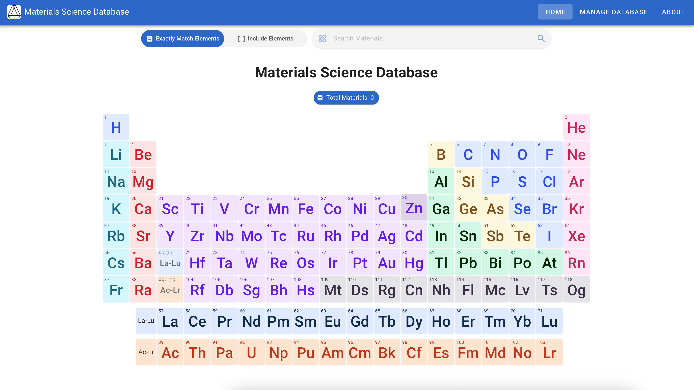
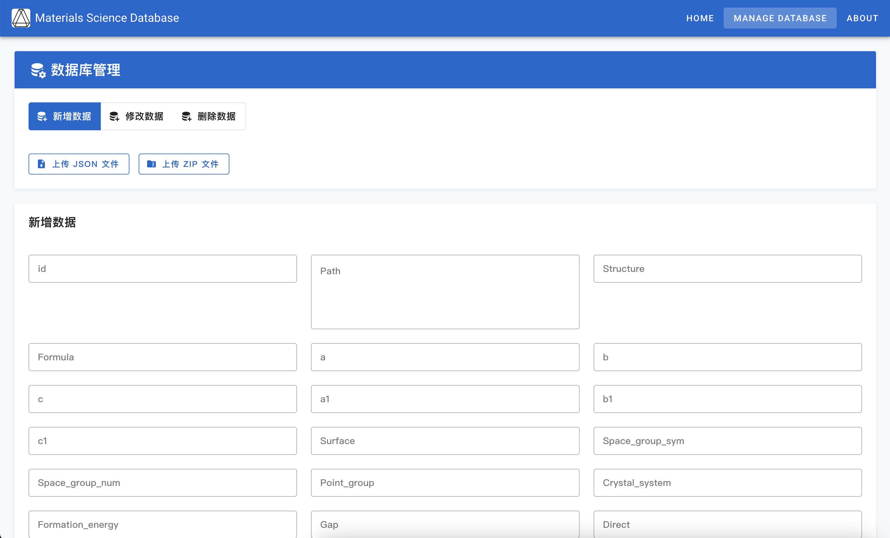

# 材料科学数据库
[](README.en.md)

## 项目简介
材料科学数据库是一个专门为材料科学研究设计的数据管理系统，致力于为材料的晶体结构数据提供存储、查询、可视化和分析功能。该系统主要针对材料科学研究人员和学生，帮助他们有效地管理、分析和利用材料数据，以促进材料研究的发展。

## 开源版本说明
该项目是材料科学数据库的开源版本。为了促进社区使用和二次开发，我们有：
1. 删除所有敏感信息和私有配置
2. 将所有硬编码的连接字符串替换为环境变量引用
3. 删除了身份验证要求，使功能可以直接访问
4. 保留了完整的体系结构和API接口设计

开源版本中的服务实现类只包括方法声明，具体实现需要根据您自己的要求和环境完成。我们在每种方法中都添加了提示注释，以方便您的二次开发。

## 系统架构
本系统采用前端和后端分离的架构：
- **前端**：使用Vue.js框架开发，使用Element Plus和Vuetify组件库结合Tailwind CSS构建用户界面
- **后端**：使用Java Spring Boot开发REST API，提供数据存储、检索和分析功能
- **数据库**：使用MongoDB存储晶体结构和磁热材料性能数据
- **存储**：支持与对象存储服务集成，用于保存CIF文件

## 核心功能

1. **物料数据管理**：支持上传、存储和管理CIF格式的晶体文件
2. **晶体结构可视化**：使用ChemDoodleWeb提供晶体结构的3D交互式显示
3. **XRD光谱生成和显示**：自动计算和显示X射线衍射（XRD）光谱
4. **磁热性能参数**：记录并显示磁热材料的关键参数，如Néel温度、形成能等
5. **高级搜索功能**：支持按化学式、空间群号、磁格子等进行多维搜索
6. **元素周期表查询**：集成交互式元素周期表，以协助材料查询

## 页面展示






## 技术特点

- **模块化设计**：后端使用多模块Maven项目结构，包括API、Service、DAO和POJO模块
- **响应式UI**：使用Vuetify和Element Plus构建的现代响应式用户界面
- **数据可视化**：提供晶体结构的球棍模型3D可视化和XRD图谱显示
- **云存储集成**：可与各种对象存储服务集成，实现基于云的CIF文件管理
- **多波长XRD数据**：支持包括CuKa、CuKa1和CuKa2在内的多个波长的XRD数据分析

## 安装和部署

### 环境要求
- JDK 21+
- Node.js 16+
- MongoDB 6.0+
- 对象存储服务（如腾讯云COS、阿里云OSS、AWS S3等）

### 配置说明
运行前需要配置以下环境变量：
- `MONGODB_USERNAME`：MONGODB用户名
- `MONGODB_PASSWORD`：MONGODB密码
- `MONGODB_HOST `：MONGODB主机地址
- `MONGODB_PORT`：MONGODB端口
- `COS_SECRET_ID`：对象存储服务访问ID
- `COS_SECRET_KEY`：对象存储服务访问密钥
- `COS_BUCKET_NAME`：对象存储服务桶名称
- `COS_REGION`：对象存储服务区域
- `COS_DOMAIN`：对象存储服务访问域

### Frontend Deployment
```bash
cd MCMD_frontend
npm install
npm run serve
```

### Backend Deployment
```bash
cd MCMD_backend
mvn clean package
java -jar api/target/mcmd_backend.jar
```

### Docker Deployment
前端和后端都提供了用于快速构建映像的Dockerfiles：
```bash
# Build frontend image
cd MCMD_frontend
docker build -t mcmd-frontend .

# Build backend image
cd MCMD_backend
docker build -t mcmd-backend .
```

## 二次开发说明
1. 后端服务实现类需要您完成，位于`MCMD_backend/service/src/main/java/com/tcmp2/service/Impl/`目录中
2. 对象存储实用程序类需要由您实现，位于`MCMD_backend/common/src/main/java/com/tcmp2/common/utils/`目录中
3. 前端配置文件中的API路径需要根据您的部署环境进行修改

## 开发团队
- College of Materials Science and Optoelectronics Technology, University of Chinese Academy of Sciences
- Kavli Institute for Theoretical Sciences
- C.-W. Zhang | zhangchengwei23[at]mails.ucas.ac.cn
- Z.-Y. Qi | qizhongyuan[at]ucas.ac.cn
- Prof. Q.-B Yan | yan[at]ucas.ac.cn

## License
This project is licensed under the MIT License